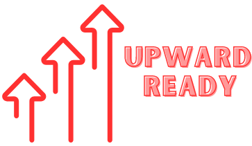

# UpwardReady

UpwardReady is a website that provides resources and motivation to high school seniors who are preparing for college and beyond. It covers topics such as applying to college, tackling senioritis, writing college essays, getting recommendation letters, and more.

## Features

- A homepage that introduces the website and its purpose
- A navigation bar that links to different sections of the website
- A resources section that contains useful links and guides for high school seniors
- A motivation section that displays inspirational quotes and stories from successful people
- A contact section that allows users to send feedback or questions to the website owner

## Technologies

- HTML: used to create the structure and content of the website
- CSS: used to style the website and make it responsive
- JavaScript: used to add interactivity and functionality to the website

## Installation

To run the website locally, you need to have a web browser and a code editor installed on your computer. You can download the source code from this repository and open the index.html file in your browser.

## Usage

You can use the website as a visitor or as a contributor. As a visitor, you can browse the different sections of the website and access the resources and motivation provided. As a contributor, you can suggest new resources, quotes, or stories to be added to the website by contacting the website owner.

## License

The website is licensed under the GNU Affero General Public License v3.0 (AGPL-3.0). You can use, modify, and distribute it for any purpose, as long as you make your source code available under the same license and give credit to the original author. You can find a copy of the license in the LICENSE file of this repository.

## Acknowledgements

The website is inspired by the personal experience of the website owner, Ibrahim Nabid, who is a first-generation college student and Virtual Transition Coach at Let's Get Ready, where he mentors high school seniors. He is also a web development enthusiast and passionate about using code to make a difference. The website also uses some external resources, such as:

- [Bootstrap](https://getbootstrap.com/): a framework for building responsive websites
- [Font Awesome](https://fontawesome.com/): a library of icons for web design
- [Unsplash](https://unsplash.com/): a source of free images for web projects
